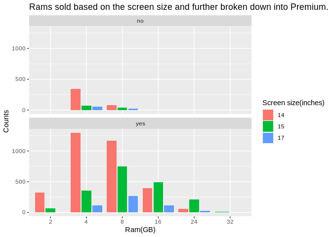
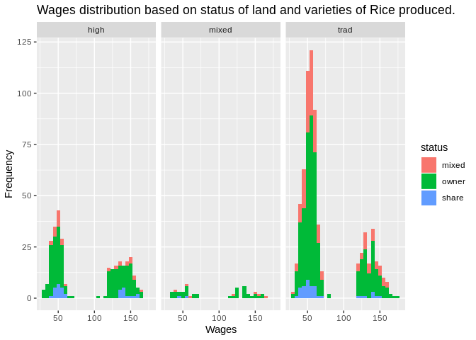
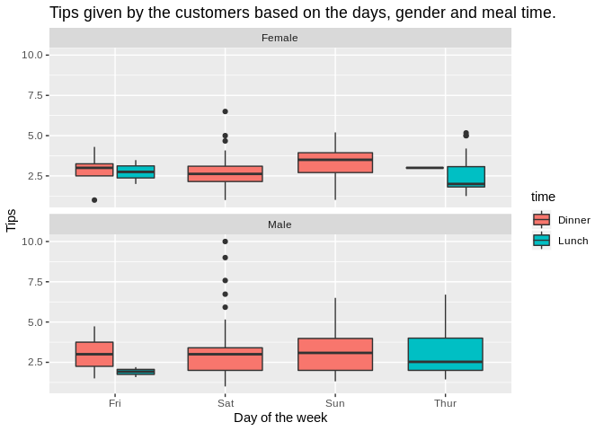
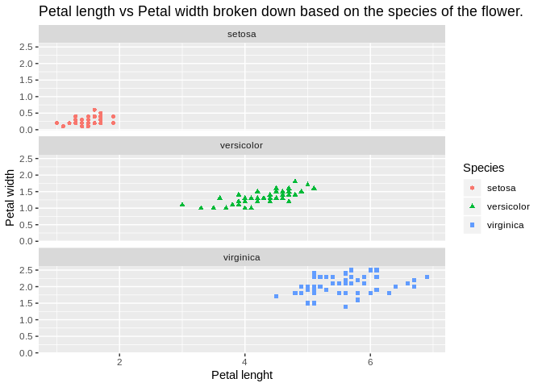

```r
library(ggplot2)
```


```r
data=read.csv('pc-price.csv',header=T)
```


```r
data[1:10,] 
```

```
##    index price speed  hd ram screen  cd multi premium ads trend
## 1      1  1499    25  80   4     14  no    no     yes  94     1
## 2      2  1795    33  85   2     14  no    no     yes  94     1
## 3      3  1595    25 170   4     15  no    no     yes  94     1
## 4      4  1849    25 170   8     14  no    no      no  94     1
## 5      5  3295    33 340  16     14  no    no     yes  94     1
## 6      6  3695    66 340  16     14  no    no     yes  94     1
## 7      7  1720    25 170   4     14 yes    no     yes  94     1
## 8      8  1995    50  85   2     14  no    no     yes  94     1
## 9      9  2225    50 210   8     14  no    no     yes  94     1
## 10    10  2575    50 210   4     15  no    no     yes  94     1
```

Note that the `echo = FALSE` parameter was added to the code chunk to prevent printing of the R code that generated the plot.

```r
ggplot(data,aes(factor(ram),fill=factor(screen)) ) +
  geom_bar(position = 'dodge2')+
  facet_wrap(~premium,ncol = 1)+
  ylab('Counts') +
  xlab('Ram(GB)')+
  ggtitle('Rams sold based on the screen size and further broken down into Premium.')+
  labs(fill='Screen size(inches)')
```

<!-- -->

```r
data2=read.csv("dataset_production_of_rice_in_indonesia.xls",header = TRUE)
```

```r
data2[1:10,]
```

```
##     X     id  size status varieties bimas seed urea phosphate pesticide
## 1   1 101001 3.000  owner     mixed mixed   90  900        80      6000
## 2   2 101001 2.000  owner      trad mixed   40  600         0      3000
## 3   3 101001 1.000  owner      high mixed  100  700       150      5000
## 4   4 101001 2.000  owner      high mixed   60  600       100      5000
## 5   5 101001 3.572  share      high    no  105  400       400     10200
## 6   6 101001 3.572  share      high    no  105  400       400     10200
## 7   7 101017 1.420  mixed      trad mixed   50  120         0         0
## 8   8 101017 1.420  mixed      high mixed   20  100         0         0
## 9   9 101017 0.428  mixed      high mixed   15  150        50       900
## 10 10 101017 0.214  owner     mixed    no    7   50         0         0
##    pseed purea pphosph hiredlabor famlabor totlabor   wage goutput noutput
## 1     80    75      75       2875       40     2915  68.49    7980    6800
## 2     70    75      75       2110       45     2155  60.09    4083    3500
## 3    140    70      70        980       95     1075  51.99    2650    2242
## 4     90    70      70       2081       10     2091  56.98    4500    3750
## 5    350    80      80       3889        1     3889 152.03   16300   13584
## 6    250    80      80       3519        1     3519 154.49   17424   14520
## 7     60    75      75        670      140      810  54.83    3840    3200
## 8     50    75      75        805       50      855  45.43    2800    2400
## 9    130    70      70        380       80      460  51.97     950     800
## 10   150    70      70         40       69      109  53.75     240     200
##    price        region
## 1     60 wargabinangun
## 2     60 wargabinangun
## 3     65 wargabinangun
## 4     70 wargabinangun
## 5    120 wargabinangun
## 6    140 wargabinangun
## 7     60 wargabinangun
## 8     50 wargabinangun
## 9     62 wargabinangun
## 10    60 wargabinangun
```


```r
ggplot(data2,aes(x=wage,fill=status)) +
  geom_histogram(binwidth = 5) +
  facet_wrap(~varieties) +
  ylab('Frequency') +
  xlab('Wages')+
  ggtitle('Wages distribution based on status of land and varieties of Rice produced.')
```

<!-- -->


```r
data3<-read.csv('dataset_tipping_data(1).csv')
```


```r
data3[1:10,]
```

```
##     X total_bill  tip    sex smoker day   time size
## 1   1      16.99 1.01 Female     No Sun Dinner    2
## 2   2      10.34 1.66   Male     No Sun Dinner    3
## 3   3      21.01 3.50   Male     No Sun Dinner    3
## 4   4      23.68 3.31   Male     No Sun Dinner    2
## 5   5      24.59 3.61 Female     No Sun Dinner    4
## 6   6      25.29 4.71   Male     No Sun Dinner    4
## 7   7       8.77 2.00   Male     No Sun Dinner    2
## 8   8      26.88 3.12   Male     No Sun Dinner    4
## 9   9      15.04 1.96   Male     No Sun Dinner    2
## 10 10      14.78 3.23   Male     No Sun Dinner    2
```


```r
ggplot(data3,aes(x=day,y=tip,fill=time)) +
  geom_boxplot()+
  facet_wrap(~sex,ncol = 1)+
  xlab('Day of the week')+
  ylab('Tips')+
  ggtitle('Tips given by the customers based on the days, gender and meal time.')
```

<!-- -->

```r
data4=read.csv("dataset_edgar_anderson_iris_data.xls",header = T)
```

```r
data4[1:10,]
```

```
##     X Sepal.Length Sepal.Width Petal.Length Petal.Width Species
## 1   1          5.1         3.5          1.4         0.2  setosa
## 2   2          4.9         3.0          1.4         0.2  setosa
## 3   3          4.7         3.2          1.3         0.2  setosa
## 4   4          4.6         3.1          1.5         0.2  setosa
## 5   5          5.0         3.6          1.4         0.2  setosa
## 6   6          5.4         3.9          1.7         0.4  setosa
## 7   7          4.6         3.4          1.4         0.3  setosa
## 8   8          5.0         3.4          1.5         0.2  setosa
## 9   9          4.4         2.9          1.4         0.2  setosa
## 10 10          4.9         3.1          1.5         0.1  setosa
```


```r
ggplot(data4,aes(x=Petal.Length,y=Petal.Width,col=Species,shape=Species))+
  geom_point()+
  facet_wrap(~Species, ncol = 1)+
  xlab('Petal lenght')+
  ylab('Petal width')+
  ggtitle('Petal length vs Petal width broken down based on the species of the flower.')
```

<!-- -->

